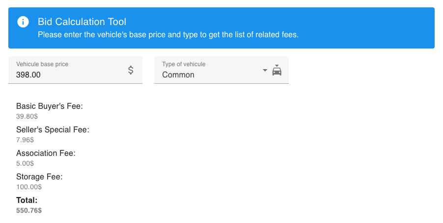

# 🧑‍💻 Coding Challenge: Aimed at Code Reviewers

## 🔍 Overview
This project allowed me to use Symfony for the very first time. It is a fullstack application designed to calculate bid-related fees based on various parameters. 
The tool was built as part of a coding challenge and demonstrates backend logic and frontend integration.
To stay within a reasonable scope, I aimed to limit development time to approximately 3-4 hours.

## 🧠 Approach
Given the limited time available, I focused on delivering a functional and maintainable solution while making trade-offs where necessary. Some constraints included:
- Implementing only essential features to meet the challenge requirements.
- Prioritizing backend calculations and basic frontend display over advanced UI/UX improvements.
- Using straightforward validation and business logic instead of a more extensive rules engine.

## ⚠️ Limitations
While the application is fully functional, some areas could be improved with more time:
- Better Data Validation: More robust type-checking and error handling could be implemented for user inputs.
- Improved UI/UX: The frontend could be enhanced with additional styling and a better user experience.
- Edge Case Handling: Some edge cases are not fully accounted for due to time constraints.
- More Comprehensive Testing: Unit and integration tests could be expanded to cover all possible scenarios.
- Implementation of a Node server for live reload of the Vue.js application.
- The VueJS application would have benefited from being split into multiple components instead of being directly in App.vue.

## 👀 Preview


---


# Project Setup & Development Guide for the Bid Calculator tool coding challenge

## Prerequisites
This project uses **DDEV** for local development. Make sure you have the following installed:

- [Docker](https://www.docker.com/get-started)
- [DDEV](https://ddev.readthedocs.io/en/stable/)

---

## 🚀 Setting Up the Project

### 1. Install DDEV and Start the Project
If DDEV is not installed, follow the [official guide](https://ddev.readthedocs.io/en/stable/#installation).

Once installed, navigate to your project directory and run:

```bash
ddev config
ddev start
```

This will set up the DDEV environment.

### 2. Install Dependencies
Inside the DDEV container, install project dependencies:

```bash
ddev exec composer install
```

### 3. Launch the Project  
Once everything is set up, start the project with the following command:  

```bash
ddev launch
```

---

## 🧪 Running PHP Unit Tests

To execute the test suite, run the following command inside the DDEV environment:

```bash
ddev exec ./vendor/bin/phpunit
```

To run tests for the Bid Calculator tool:

```bash
ddev exec ./vendor/bin/phpunit tests/Controller/BidCalculatorControllerTest.php
```

---

## 📌 Useful DDEV Commands

| Command                     | Description                                  |
|-----------------------------|----------------------------------------------|
| `ddev start`                | Start the DDEV environment                   |
| `ddev stop`                 | Stop all DDEV services                       |
| `ddev restart`              | Restart the project                          |
| `ddev exec composer install`| Install PHP dependencies                     |
| `ddev exec phpunit`         | Run PHPUnit tests                            |
| `ddev ssh`                  | Access the container's shell                 |

---

## ❓ Troubleshooting

- **DDEV is not working properly?** Try running:
  ```bash
  ddev poweroff
  ddev start
  ```

- **Dependencies not found?** Ensure `composer install` has been executed.

---

## 🛠️ Resources

- [DDEV Documentation](https://ddev.readthedocs.io/)
- [Symfony Documentation](https://symfony.com/doc/current/index.html)
- [PHPUnit Documentation](https://phpunit.de/documentation.html)